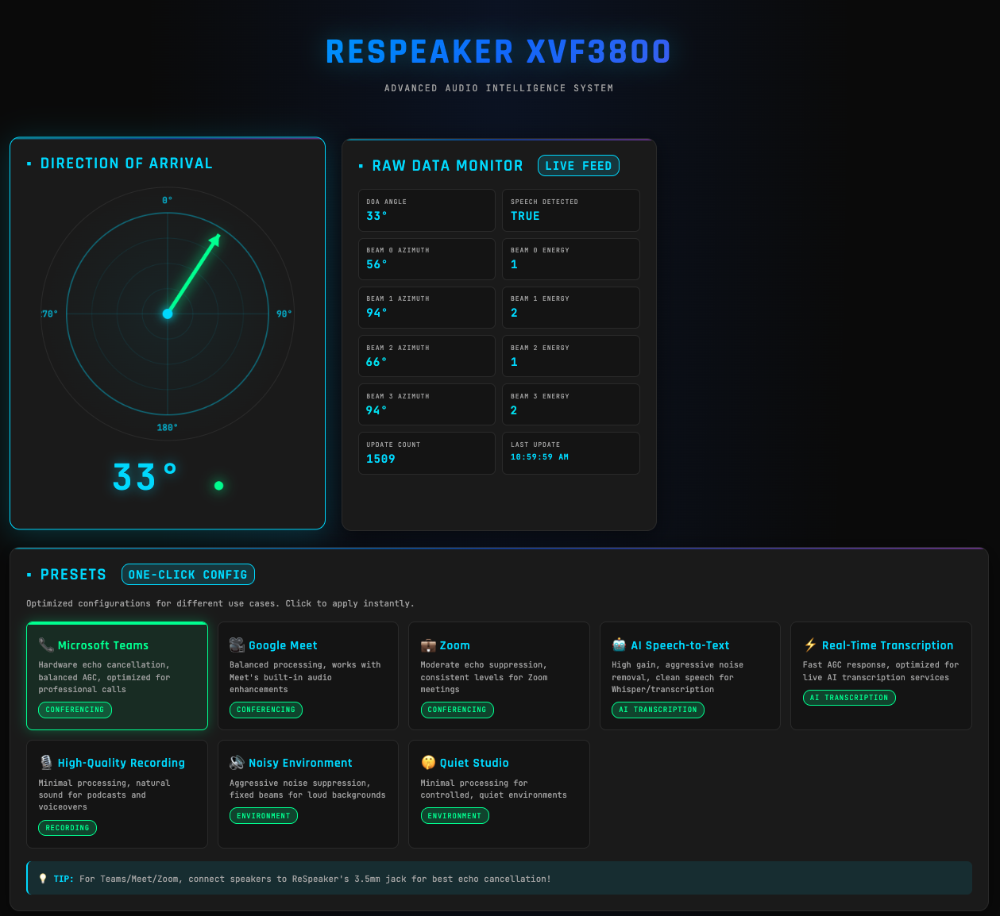

# reSpeaker XMOS XVF3800 – AI-powered 4-Mic Array




Getting the most out of the ReSpeaker XVF3800 USB 4-Mic Array connected to a Mac Mini via USB-C.

## What This Device Does

The ReSpeaker XVF3800 is a professional circular 4-microphone array that goes well beyond a standard USB mic. It runs an XMOS XVF3800 processor that handles audio processing on-chip before the audio even reaches your Mac:

- **360° voice capture** up to 5 meters away
- **Acoustic Echo Cancellation (AEC)** — removes speaker feedback during calls
- **Noise suppression + de-reverberation** — cleans up room acoustics
- **Beamforming** — focuses on the active speaker's direction
- **Direction of Arrival (DoA)** — tells you which direction sound is coming from (0-359°)
- **Voice Activity Detection (VAD)** — knows when someone is actually speaking
- **Automatic Gain Control (AGC)** — keeps volume levels consistent
- **12 RGB LEDs** — programmable ring for visual feedback
- **3.5mm headphone jack + JST speaker output** (5W amplified)

## Quick Start — USB Mic on Mac Mini

### Important: Two USB-C Ports

The board has **two USB-C ports**:
1. **XMOS USB-C** (near the 3.5mm jack) — use this for USB audio mode
2. **XIAO ESP32S3 USB-C** (opposite side) — only for programming the ESP32

**Always use the XMOS USB-C port** when using the device as a USB microphone.

### First-Time Setup

1. **Plug in** the ReSpeaker to your Mac Mini via the **XMOS USB-C port**
2. The **LEDs should show a rainbow pattern** for ~2 seconds, then switch to **DoA mode** (pointing toward sound)
3. Go to **System Settings > Sound > Input** and verify "reSpeaker XVF3800 4-Mic Array" is listed and selected
4. Speak toward the mic — the **input level meter should react**

The device works immediately as USB Audio Class 2.0 — no drivers needed. It outputs processed audio (noise-suppressed, echo-cancelled, beamformed) at **16kHz, 2-channel stereo**.

### Troubleshooting: Device Not Detected

If the ReSpeaker doesn't show up as a USB audio device, it may have **I2S firmware** loaded instead of USB firmware. This happens if:
- The device was previously used with XIAO ESP32S3 for ESPHome/Home Assistant
- Someone flashed I2S firmware by mistake

**Fix: Flash USB firmware via Safe Mode**

1. Install dfu-util (one time):
   ```bash
   brew install dfu-util
   ```

2. Clone the firmware repo (one time):
   ```bash
   cd ~/Documents/PROJECTS/respeaker_project
   git clone https://github.com/respeaker/reSpeaker_XVF3800_USB_4MIC_ARRAY.git
   ```

3. Enter Safe Mode:
   - **Unplug** the USB-C cable
   - **Press and hold the Mute button** (the one near the LEDs)
   - **While holding Mute, plug the USB-C cable back in** (XMOS port)
   - **Wait for red LED blinking** — this confirms Safe Mode
   - **Release the Mute button**

4. Verify DFU mode:
   ```bash
   dfu-util -l
   ```
   You should see: `Found DFU: [2886:001a] ... "reSpeaker DFU Upgrade"`

5. Flash USB firmware:
   ```bash
   dfu-util -R -e -a 1 -D reSpeaker_XVF3800_USB_4MIC_ARRAY/xmos_firmwares/usb/respeaker_xvf3800_usb_dfu_firmware_v2.0.7.bin
   ```

6. Wait for the flash to complete and the device to reboot (~10 seconds)

7. Verify detection:
   ```bash
   system_profiler SPAudioDataType | grep -A 8 "reSpeaker"
   ```

The device should now appear as "reSpeaker XVF3800 4-Mic Array" in your audio devices.

### LED Behavior

- **Rainbow pattern on boot** → switches to **DoA mode after 2 seconds** (default)
- **DoA mode**: LEDs point toward the direction of detected sound
- **Red LED** (near Mute button): lights up when microphone is muted
- **Green/blue flashing**: usually indicates I2S firmware is loaded (not USB mode)

## Advanced Control with xvf_host

The `xvf_host` command-line tool lets you control the device's features from your Mac.

### Setup

```bash
git clone https://github.com/respeaker/reSpeaker_XVF3800_USB_4MIC_ARRAY.git
cd reSpeaker_XVF3800_USB_4MIC_ARRAY/host_control/mac_arm64

# macOS will block unsigned binaries on first run.
# Go to System Settings > Privacy & Security and click "Allow Anyway" for each:
#   xvf_host, libcommand_map.dylib, libdevice_usb.dylib, libusb-1.0.0.dylib
# You may need to run xvf_host once, approve it, and repeat for each library.
```

### LED Control

```bash
./xvf_host LED_EFFECT 1        # Breathing effect
./xvf_host LED_EFFECT 2        # Rainbow
./xvf_host LED_EFFECT 3        # Solid color
./xvf_host LED_EFFECT 4        # DoA tracking (points toward speaker)
./xvf_host LED_EFFECT 0        # LEDs off

./xvf_host LED_BRIGHTNESS 128  # Half brightness (0-255)
./xvf_host LED_COLOR 0 0 255 0 # Blue (R G B 0, little-endian bytes)
./xvf_host LED_SPEED 2         # Animation speed
```

### Direction of Arrival

```bash
./xvf_host DOA_VALUE           # Returns angle (0-359°) of detected voice
```

### Audio Tuning

```bash
./xvf_host AUDIO_MGR_MIC_GAIN 90       # Microphone gain
./xvf_host PP_AGCMAXGAIN 64            # Max auto gain
./xvf_host SAVE_CONFIGURATION          # Persist settings across reboots
```

## Python Control

For scripting and building applications, use the Python SDK directly — no `xvf_host` binary needed.

### Setup

```bash
pip install pyusb
```

### Read Direction of Arrival

```python
import usb.core
import struct
import time

class ReSpeaker:
    TIMEOUT = 100000
    def __init__(self, dev):
        self.dev = dev

    def read(self, resid, cmdid, length):
        return self.dev.ctrl_transfer(
            usb.util.CTRL_IN | usb.util.CTRL_TYPE_VENDOR | usb.util.CTRL_RECIPIENT_DEVICE,
            0, 0x80 | cmdid, resid, length + 1, self.TIMEOUT
        )

dev = usb.core.find(idVendor=0x2886, idProduct=0x001A)
if dev is None:
    raise RuntimeError("ReSpeaker not found")

mic = ReSpeaker(dev)

while True:
    # DOA_VALUE: resid=20, cmdid=18, length=4
    result = mic.read(20, 18, 4)
    status = result[0]
    doa_angle = struct.unpack_from('<H', result, 1)[0]
    speech_detected = result[3]
    print(f"DoA: {doa_angle}°  Speaking: {bool(speech_detected)}")
    time.sleep(0.5)
```

### Control LEDs from Python

```python
# LED_EFFECT: resid=20, cmdid=12
dev.ctrl_transfer(
    usb.util.CTRL_OUT | usb.util.CTRL_TYPE_VENDOR | usb.util.CTRL_RECIPIENT_DEVICE,
    0, 12, 20, [2]  # Rainbow effect
)

# LED_BRIGHTNESS: resid=20, cmdid=13
dev.ctrl_transfer(
    usb.util.CTRL_OUT | usb.util.CTRL_TYPE_VENDOR | usb.util.CTRL_RECIPIENT_DEVICE,
    0, 13, 20, [200]  # Brightness 200/255
)
```

The full parameter list is in `python_control/xvf_host.py` in the official repo.

## Recording Audio

### With Audacity
1. Open Audacity
2. Set input device to the ReSpeaker
3. Set sample rate to **16000 Hz**, format to **24-bit**, channels to **Stereo**
4. Hit record

### With ffmpeg
```bash
# List audio devices
ffmpeg -f avfoundation -list_devices true -i ""

# Record 10 seconds (replace [INDEX] with the ReSpeaker's device index)
ffmpeg -f avfoundation -i ":[INDEX]" -ar 16000 -ac 2 -t 10 output.wav
```

### With sox
```bash
brew install sox
rec -r 16000 -c 2 -b 24 output.wav
```

## Firmware

The device ships with 2-channel USB firmware. Alternative firmwares are available:

| Firmware | Channels | Use Case |
|----------|----------|----------|
| `usb_dfu_firmware_v2.0.7.bin` | 2 | Standard (processed audio) |
| `usb_dfu_firmware_6chl_v2.0.8.bin` | 6 | Processed + raw mic data |
| `i2s_master_dfu_firmware_v1.0.7_48k_test5.bin` | I2S | Embedded use with XIAO ESP32S3 |

### Flashing Firmware

```bash
brew install dfu-util

# Enter safe mode: hold Mute button while reconnecting USB
# Verify device is detected:
dfu-util -l

# Flash:
dfu-util -R -e -a 1 -D path/to/firmware.bin
```

## Use Cases

| Goal | Approach |
|------|----------|
| Better mic for calls | Plug in, select as input — AEC handles echo |
| Voice commands / assistant | Python SDK for DoA + VAD, feed audio to speech-to-text |
| Meeting transcription | Record with Audacity/ffmpeg, process with Whisper |
| Podcast recording | Record in Audacity at 16kHz/24-bit with noise suppression |
| Visual feedback | Control 12 RGB LEDs via xvf_host or Python |
| Sound source tracking | Poll DoA for real-time 360° speaker direction |
| Home Assistant satellite | Flash I2S firmware, use ESPHome with XIAO ESP32S3 |
| Smart room presence | Use VAD + DoA to detect and locate speakers |

## Hardware Specs

- **Processor**: XMOS XVF3800
- **Audio codec**: TLV320AIC3104
- **Microphones**: 4x MEMS, circular array
- **LEDs**: 12x WS2812 addressable RGB
- **USB**: Type-C, USB Audio Class 2.0
- **Audio output**: 3.5mm AUX jack + JST speaker connector (5W amp)
- **Buttons**: Mute (with indicator LED) + Reset
- **Sample rate**: 16 kHz (USB), 48 kHz (I2S)

## Web Control Dashboard

A browser-based dashboard for real-time device control and monitoring. See [`web_app/README.md`](web_app/README.md) for full documentation and API reference.

```bash
cd web_app
pip3 install -r requirements.txt
python3 app.py
# Open http://localhost:5001
```

**Features**: DoA radar visualization, beam energy meters, LED control (effects, color, brightness), 8 audio tuning presets, audio recording/playback, GPIO monitoring, and save/reset/reboot device persistence controls.


## Roadmap

- [ ] **Wake word detection** — offline wake word engine ([OpenWakeWord](https://github.com/dscripka/openWakeWord)) listening continuously via the mic array, with LED feedback on detection
- [ ] **Voice transcription** — on-device speech-to-text using [MLX Whisper](https://github.com/ml-explore/mlx-examples/tree/main/whisper) (Apple Silicon accelerated), triggered after wake word
- [ ] **Wake word + transcription UI** — dashboard card with state indicator, confidence bar, transcription history, and SSE real-time updates
- [ ] **6-channel firmware support** — expose raw mic data alongside processed audio (firmware v2.0.8)
- [ ] **Audio output routing controls** — configure which beam/channel is routed to USB output (left/right)
- [ ] **Export/import preset configurations** — share tuning profiles as JSON files

## Resources

- [Official GitHub repo](https://github.com/respeaker/reSpeaker_XVF3800_USB_4MIC_ARRAY)
- [Seeed Studio Wiki — Getting Started](https://wiki.seeedstudio.com/respeaker_xvf3800_introduction/)
- [Python SDK docs](https://wiki.seeedstudio.com/respeaker_xvf3800_python_sdk/)
- [ESPHome integration (formatBCE)](https://github.com/formatBCE/Respeaker-XVF3800-ESPHome-integration)
- [Xiaozhi voice assistant](https://github.com/Seeed-Projects/Xiaozhi_Esp32S3_reSpeaker)
