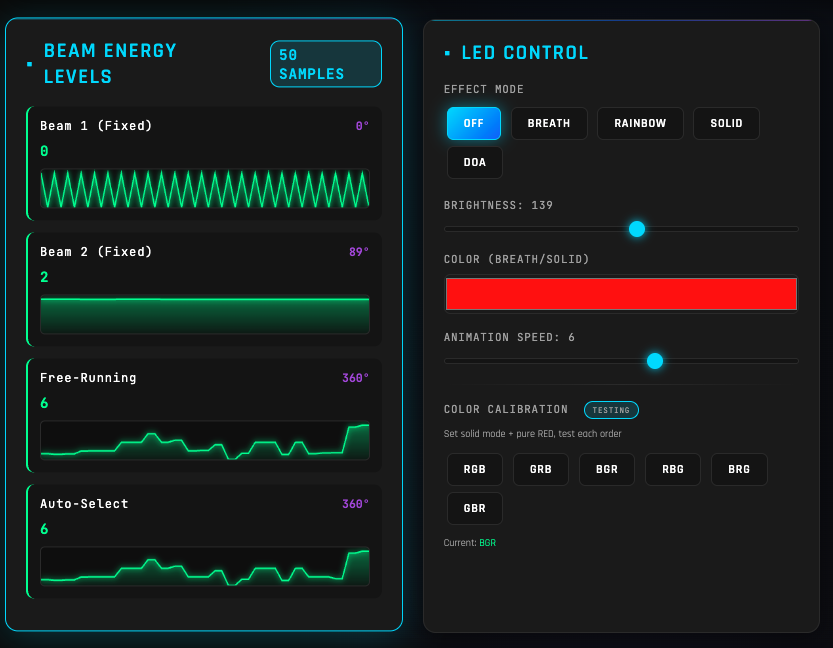
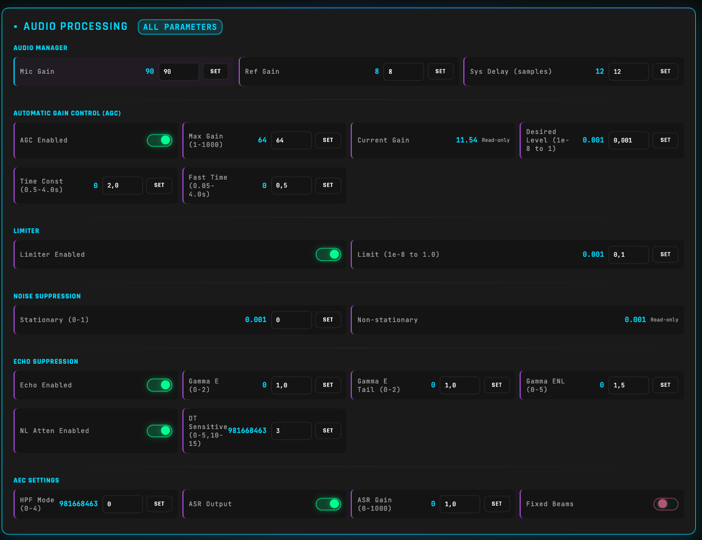
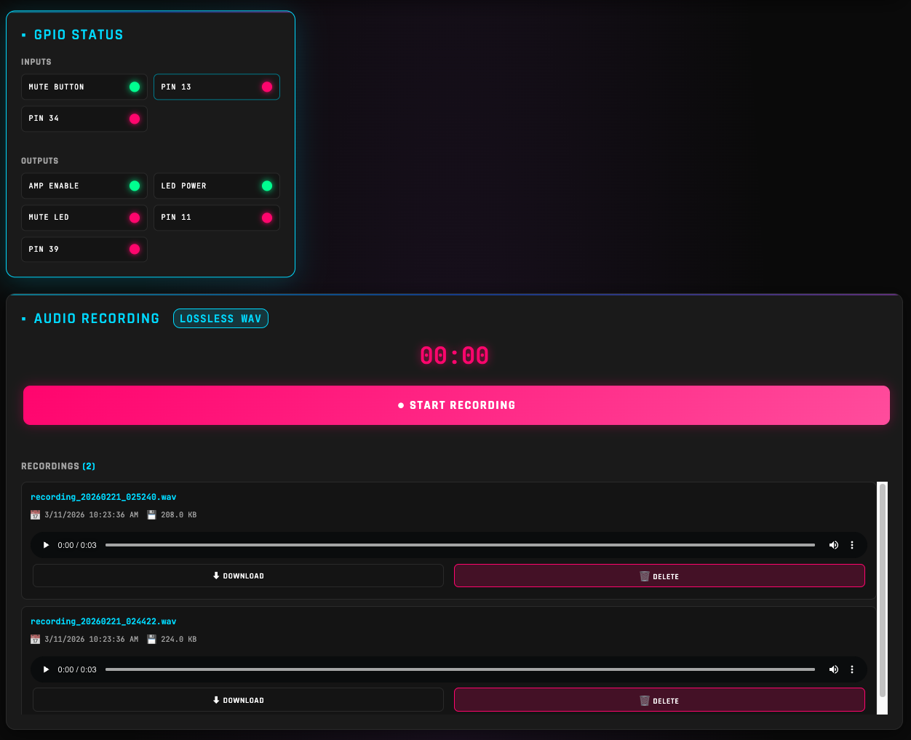

# ReSpeaker XVF3800 Web Control Dashboard

Real-time visualization and control interface for the ReSpeaker XVF3800 4-Mic Array.


## Features

### 🎯 Direction of Arrival (DoA) Visualization
- **Circular radar display** showing where sound is coming from (0-359°)
- **Real-time arrow** pointing toward detected sound source
- **Speech detection indicator** lights up green when speech is detected
- **Beam azimuth overlay** showing all 4 beam directions



### 📊 Beam Energy Levels
- **4 live meters** showing speech energy for each beam:
  - Beam 1 (fixed beam)
  - Beam 2 (fixed beam)
  - Free-running beam
  - Auto-select beam
- **Real-time energy values** updated 5 times per second
- **Azimuth angles** displayed for each beam

### 💡 LED Control
- **Effect modes**: Off, Breath, Rainbow, Solid Color, DoA tracking
- **Brightness control**: 0-255 slider with live update
- **Color picker**: Set custom RGB colors for Breath/Solid modes
- **Animation speed**: Control how fast effects animate



### 🎛️ Audio Settings Display
- **Microphone Gain**: Current input gain level
- **AGC Max Gain**: Maximum automatic gain control
- **AGC Current**: Current AGC level
- **Noise Suppression**: Gain-floor for noise reduction



### 🔌 GPIO Status
- **Input pins**: Mute button, X1D13, X1D34 status
- **Output pins**: Mute LED, amplifier enable, LED power, and more
- **Visual indicators**: Green = HIGH, Red = LOW

## Installation

```bash
cd web_app
pip3 install -r requirements.txt
```

## Usage

Start the server:
```bash
python3 app.py
```

Then open in your browser:
- **Local**: http://localhost:5001
- **Network**: http://<your-ip>:5001 (accessible from other devices on your network)

## API Endpoints

### GET `/api/status`
Returns complete device status including DoA, beam energies, GPIO, and audio settings.

### POST `/api/led/effect`
Set LED effect mode (0=off, 1=breath, 2=rainbow, 3=solid, 4=doa)
```json
{"effect": 2}
```

### POST `/api/led/brightness`
Set LED brightness (0-255)
```json
{"brightness": 128}
```

### POST `/api/led/color`
Set LED color (RGB)
```json
{"r": 255, "g": 0, "b": 255}
```

### POST `/api/led/speed`
Set animation speed
```json
{"speed": 1}
```

## Technical Details

- **Update rate**: 200ms (5 updates per second)
- **Backend**: Flask + pyusb
- **Frontend**: Vanilla JavaScript with Canvas API
- **Communication**: USB vendor control transfers
- **USB IDs**: VID=0x2886, PID=0x001A

## Requirements

- ReSpeaker XVF3800 with USB firmware (v2.0.7 or later)
- Python 3.7+
- Flask 3.0.0
- pyusb 1.2.1

## Troubleshooting

**Device not found**: Make sure the ReSpeaker is connected via the XMOS USB-C port (near 3.5mm jack) and has USB firmware loaded (not I2S firmware).

**Permission denied (Linux)**: Add udev rules for USB access or run with sudo.

**Port 5001 in use**: Change the port in `app.py` line 229.
